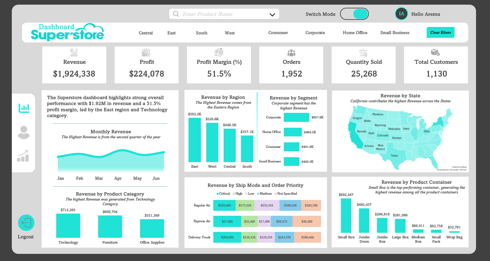
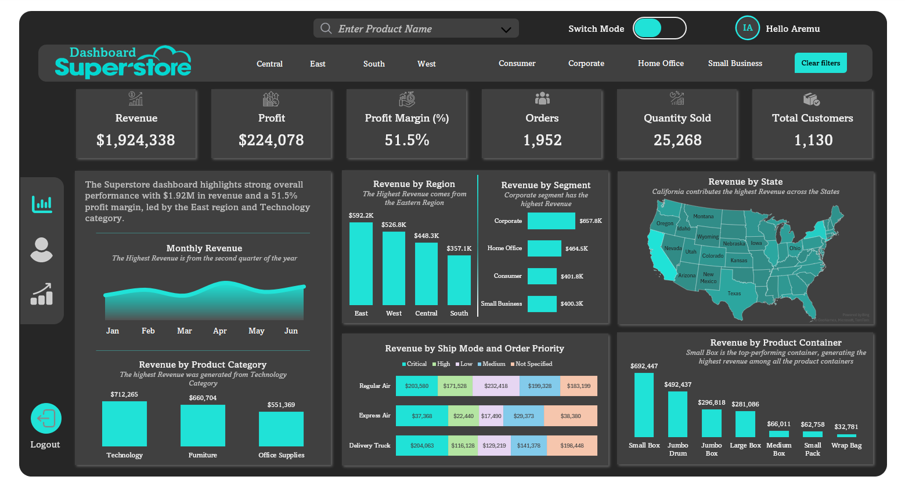

# 📊 Superstore Analytics Dashboard (Dual Theme)

 

## 📖 Project Overview

The **Superstore Analytics Dashboard** is a comprehensive business intelligence tool designed to visualize sales performance, profitability, and customer trends for a fictional retail superstore. 

The primary goal of this project is to transform raw sales data into actionable insights, enabling stakeholders to monitor KPIs such as Revenue, Profit Margins, and Shipping Efficiency. A standout feature of this dashboard is its fully integrated **Light and Dark Mode** capability, ensuring accessibility and user preference flexibility.

---

## 📸 Dashboard Previews

### ☀️ Light Mode
*Optimized for clarity and presentation in bright environments.*

### 🌙 Dark Mode
*Optimized for low-light environments and reduced eye strain.*

---

## 🔑 Key Features

### 1. high-Level KPI Tracking
Immediate visibility into the most critical business metrics:
* **Total Revenue:** $1,924,338
* **Total Profit:** $224,078
* **Profit Margin:** 51.5% (High efficiency)
* **Total Orders & Customers:** Tracking volume and reach.

### 2. User Experience (UX) Enhancements
* **Theme Switcher:** Seamless toggle between Light and Dark visual themes.
* **Dynamic Filtering:** Filter data by Region (Central, East, South, West), Customer Segment, and Product Category.
* **Search Functionality:** Integrated search bar for product lookups.

### 3. Detailed Analytical Views
* **Geospatial Analysis:** A map visualization highlights California and New York as key revenue drivers.
* **Temporal Trends:** A smooth area chart visualizes Monthly Revenue, identifying Q2 as the peak performance period.
* **Segment Analysis:** Breakdown of revenue by Consumer, Corporate, and Home Office segments.
* **Logistics Insights:** A heatmap/stacked analysis of Shipping Modes (Regular Air vs. Delivery Truck) against Order Priority.

---

## 🧠 Business Insights Derived

Based on the current dataset snapshot:
1.  **Regional Dominance:** The **East Region** is the highest revenue generator ($592.2K), significantly outperforming the South.
2.  **Category Leaders:** The **Technology** category drives the most revenue ($712K), followed closely by Furniture.
3.  **Shipping Efficiency:** The **Small Box** container type is the top-performing shipping vessel, generating the highest revenue among container types ($692K).
4.  **Segment Performance:** The **Corporate Segment** ($657.8K) is the most valuable customer base, overtaking the Consumer segment.

---

## 🛠️ Tech Stack & Data Flow

* **Data Source:** Sample Superstore Dataset (.CSV).
* **Data Transformation:** `Power Query` used for cleaning and modeling.
* **Visualization Tool:** `Microsoft Excel`.

---

## 👤 Author

**Aremu Ibrahim**
* [LinkedIn Profile Link](https://www.linkedin.com/in/aremu-theanalyst/)
* [Portfolio Link](https://aremuibrahim.carrd.co/)
